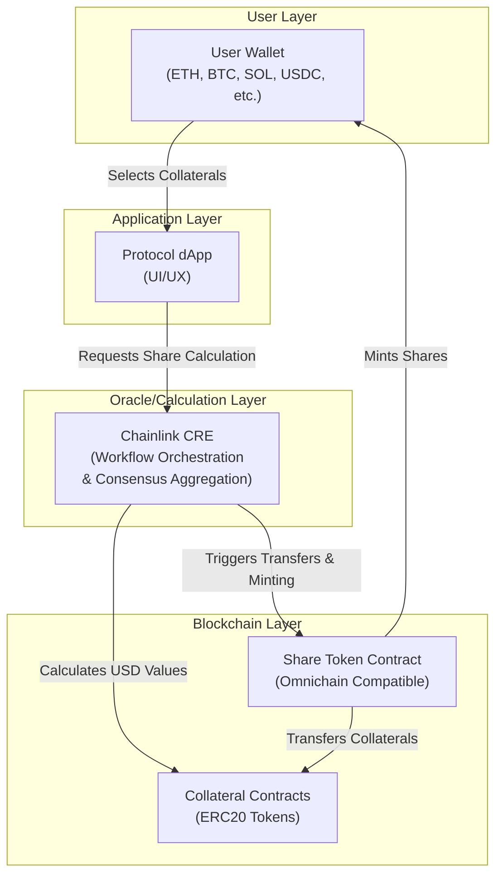
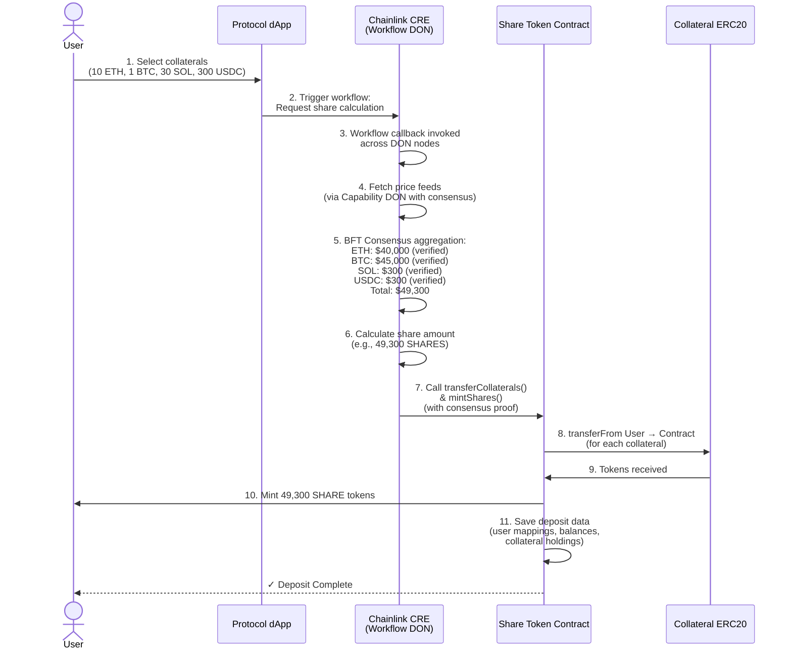
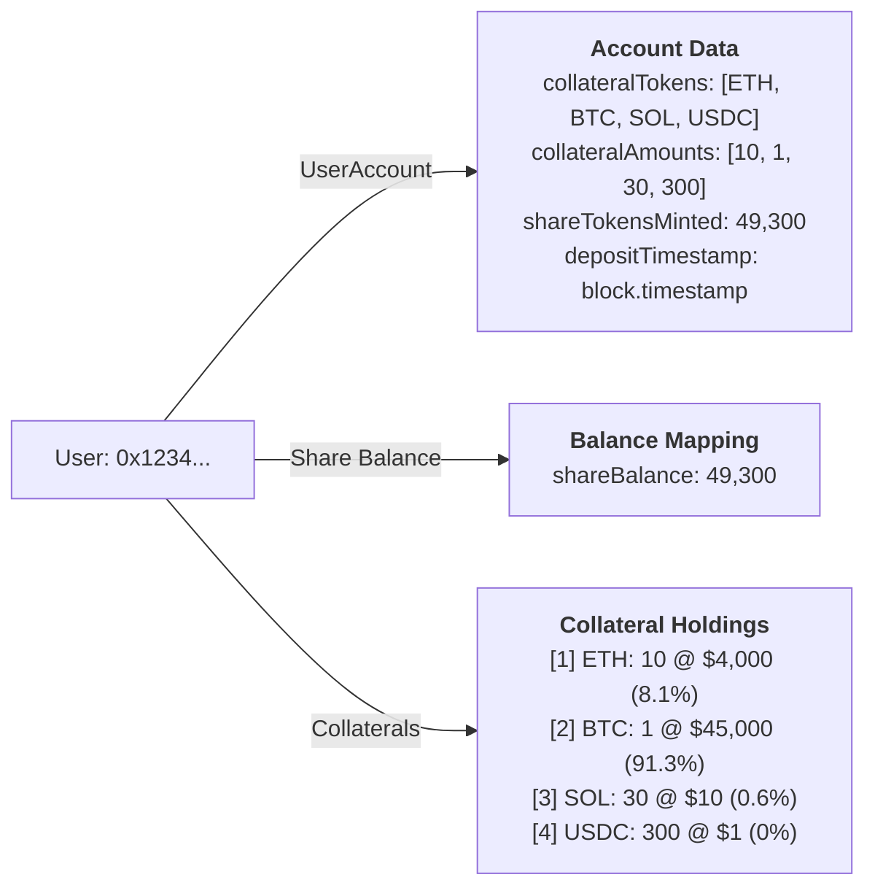
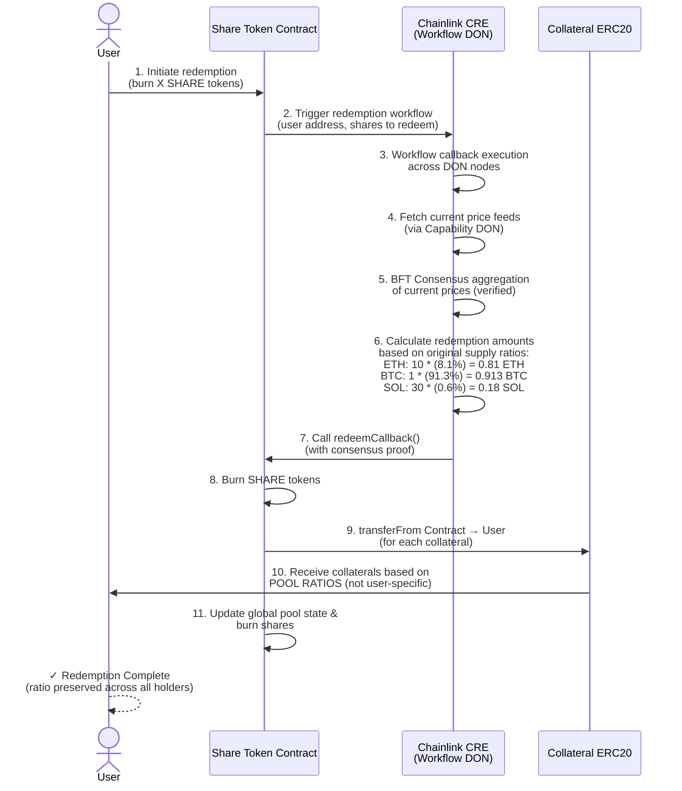

# Unified Share Token for Multiple/Dynamic Collateral

## Overview

A protocol that allows users to deposit multiple types of collateral (ETH, BTC, SOL, USDC, etc.) across different blockchains and receive a unified **SHARE token** in return. The system leverages **Chainlink CRE (Chainlink Runtime Environment)** to orchestrate and calculate fair share allocation based on consensus-verified USD valuations of supplied collaterals.

---

## System Architecture

### Core Components



---

## Data Structures

### Share Token Contract (Global Pool State)

**Critical Design Principle**: Redemption ratios are maintained **globally** based on total collateral in the pool and total shares issued. Share tokens are fully ERC20 transferrable—when shares are transferred to another wallet, the redemption ratio remains **constant** because it's determined by aggregate pool state, not individual user deposits.

```solidity
// ===== GLOBAL POOL STATE (determines redemption ratios) =====
// Total collateral held by contract for each token
mapping(address => uint256) totalCollateralBalance;  // [tokenAddress => amount]

// Total shares ever issued
uint256 public totalSharesIssued;

// Total shares currently outstanding (circulating)
uint256 public totalSharesOutstanding;

// ===== SHARE TOKEN STATE (ERC20 Standard) =====
// Share token balances - shares are fully transferrable
mapping(address => uint256) shareBalance;

// ERC20 approval mechanism for transfers
mapping(address => mapping(address => uint256)) allowance;

// ===== DEPOSIT HISTORY (For transparency & audit trail) =====
// Track original deposits for historical reference
mapping(address => UserDeposit[]) depositHistory;

struct UserDeposit {
    address[] collateralTokens;      // List of collateral types deposited
    uint256[] collateralAmounts;     // Amounts of each collateral
    uint256 sharesMinted;            // Shares issued for this deposit
    uint256 usdValueAtDeposit;       // Total USD value at deposit time
    uint256 depositTimestamp;        // When deposit was made
    address initiatingUser;          // Original depositor
}

struct CollateralInPool {
    address tokenAddress;            // Token contract address
    uint256 totalAmount;             // Total amount currently in pool
    uint256 poolRatio;               // Ratio in pool (out of 100000 = 100%)
}
```

---

## Redemption Ratio Mechanism

### How Original Ratios Are Preserved Across Transfers

The **key principle**: Redemption ratios are determined by the **ORIGINAL DEPOSIT RATIO** of the depositor who created those shares. Share transferability doesn't change the collateral mix—the shares always redeem according to what was originally deposited.

This ensures that:
✓ Shares always redeem for the same original collateral mix
✓ Original deposit ratios are locked in when shares are created
✓ Share transferees receive exactly what the original depositor would receive
✓ The protocol is fair and predictable

### Original Deposit Ratio Tracking

Each batch of shares tracks its origin:

```
Share Batch Data Structure:
├─ Original Depositor: User A
├─ Original Deposit Ratios:
│  ├─ ETH: 10 (locked ratio)
│  ├─ BTC: 1 (locked ratio)
│  ├─ SOL: 30 (locked ratio)
│  └─ USDC: 300 (locked ratio)
├─ Shares Issued: 49,300 SHARES
├─ Current Holder: User B (after transfer)
└─ Redemption Amount per Share: 
   ├─ ETH: 10 / 49,300 = 0.0002028 ETH per SHARE
   ├─ BTC: 1 / 49,300 = 0.00002028 BTC per SHARE
   ├─ SOL: 30 / 49,300 = 0.0006084 SOL per SHARE
   └─ USDC: 300 / 49,300 = 0.006084 USDC per SHARE
```

### Original Deposit Ratio Calculation

```
When User redeems N shares from Deposit D:

For each collateral C in the original deposit:
  Redeemable Amount[C] = (N × Original Deposit Amount[C]) / Total Shares from Deposit D

Example with original deposit of {10 ETH, 1 BTC, 30 SOL, 300 USDC} → 49,300 SHARES:

If redeeming 4,930 SHARES (10% of 49,300):
  - ETH: (4,930 × 10) / 49,300 = 1 ETH
  - BTC: (4,930 × 1) / 49,300 = 0.1 BTC
  - SOL: (4,930 × 30) / 49,300 = 3 SOL
  - USDC: (4,930 × 300) / 49,300 = 30 USDC

If redeeming 24,650 SHARES (50% of 49,300):
  - ETH: (24,650 × 10) / 49,300 = 5 ETH
  - BTC: (24,650 × 1) / 49,300 = 0.5 BTC
  - SOL: (24,650 × 30) / 49,300 = 15 SOL
  - USDC: (24,650 × 300) / 49,300 = 150 USDC
```

### Example: Share Transfer & Redemption (Original Ratios Preserved)

```
═══════════════════════════════════════════════════════════════

STEP 1: INITIAL DEPOSIT BY USER A
═══════════════════════════════════════════════════════════════

User A deposits:
  - 10 ETH @ $4,000 = $40,000
  - 1 BTC @ $45,000 = $45,000  
  - 30 SOL @ $10 = $300
  - 300 USDC @ $1 = $300
  Total: $49,300 USD

Shares Issued: 49,300 SHARES

SHARE BATCH A CREATED (immutable original deposit record):
  Original Depositor: User A
  Original Collaterals: [ETH: 10, BTC: 1, SOL: 30, USDC: 300]
  Total Shares from This Deposit: 49,300
  Redemption per SHARE:
    - ETH: 10 / 49,300 = 0.0002028 ETH/SHARE
    - BTC: 1 / 49,300 = 0.00002028 BTC/SHARE
    - SOL: 30 / 49,300 = 0.0006084 SOL/SHARE
    - USDC: 300 / 49,300 = 0.006084 USDC/SHARE

GLOBAL POOL STATE (informational only, not used for this batch):
  - Total ETH: 10
  - Total BTC: 1
  - Total SOL: 30
  - Total USDC: 300
  - Total Shares Issued: 49,300

═══════════════════════════════════════════════════════════════

STEP 2: USER A TRANSFERS SHARES TO USER B
═══════════════════════════════════════════════════════════════

User A transfers: 24,650 SHARES to User B
(approximately 50% of the batch)

BALANCES AFTER TRANSFER:
  - User A: 24,650 SHARES (from Batch A)
  - User B: 24,650 SHARES (from Batch A) ← NEW HOLDER
  - User C: 0 SHARES

⚠️  CRITICAL: Batch A's Original Ratio UNCHANGED!
  - Original Depositor: User A
  - Original Collaterals: {10 ETH, 1 BTC, 30 SOL, 300 USDC} ← IMMUTABLE
  - Redemption per SHARE: Same as before
  - Total Shares Outstanding: 49,300

═══════════════════════════════════════════════════════════════

STEP 3: USER B REDEEMS 24,650 SHARES
═══════════════════════════════════════════════════════════════

User B (new holder of Batch A shares) initiates redemption for 24,650 SHARES

Redemption Calculation (using ORIGINAL BATCH RATIOS, not pool ratios):
  
  For ETH:
    Amount = (24,650 SHARES × 10 ETH) / 49,300 Total Shares
           = 0.5 × 10 ETH
           = 5 ETH ✓
  
  For BTC:
    Amount = (24,650 × 1 BTC) / 49,300
           = 0.5 × 1 BTC
           = 0.5 BTC ✓
  
  For SOL:
    Amount = (24,650 × 30 SOL) / 49,300
           = 0.5 × 30 SOL
           = 15 SOL ✓
  
  For USDC:
    Amount = (24,650 × 300 USDC) / 49,300
           = 0.5 × 300 USDC
           = 150 USDC ✓

User B Receives: 5 ETH, 0.5 BTC, 15 SOL, 150 USDC
              = 50% of User A's ORIGINAL deposit ✓

═══════════════════════════════════════════════════════════════

STEP 4: REMAINING SHARES & FUTURE REDEMPTIONS
═══════════════════════════════════════════════════════════════

Remaining Shares in Circulation:
  - From Batch A: 24,650 SHARES (owned by User A)

If User A redeems their remaining 24,650 SHARES:
  Receives: 5 ETH, 0.5 BTC, 15 SOL, 150 USDC
  (Same original ratio maintained!)

═══════════════════════════════════════════════════════════════

KEY INSIGHT:
✓ User A (original depositor) redeems 24,650 shares → Gets 50% of original
✓ User B (transferee) redeems 24,650 shares → Gets 50% of original (SAME!)
✓ Original ratio locked at deposit time: {10 ETH, 1 BTC, 30 SOL, 300 USDC}
✓ Transferability doesn't change the ratio
✓ Fair for all holders: original depositor AND secondary buyers

═══════════════════════════════════════════════════════════════
```

---

## User Deposit Workflow

### Step-by-Step Flow



---

## Data Storage Example

When a user deposits (10 ETH, 1 BTC, 30 SOL, 300 USDC):



---

## Redemption Workflow

### Redeeming Shares Back to Original Collaterals



**Important**: The redemption amounts are calculated using the **original deposit ratios**, not individual deposit history. This means:
- Any wallet holding shares (original depositor or transferee) receives the same original collateral mix
- The ratio is: (Shares to Redeem / Total Shares from This Deposit) × (Each Original Collateral Amount)
- Ratios are immutable and determined at deposit time

---

## Key Features

### 1. **Fully Transferrable Share Tokens (ERC20 Standard)**
- Share tokens are standard ERC20 tokens with full transfer and trading capabilities
- Users can sell, trade, or gift shares to other wallets
- Share transfers don't affect redemption ratios for any holder
- Both original depositors and secondary market participants can redeem anytime

### 2. **Immutable Original Deposit Ratios Across Transfers**
- Each share batch maintains the **original deposit ratio** when created
- Redemption is based on what the original depositor supplied, not current pool state
- Any wallet holding shares receives the exact collateral mix the original depositor would get
- Ratio formula: (Shares to Redeem / Total Shares from Deposit) × (Original Collateral Amount)
- **Example**: If original deposit was {10 ETH, 1 BTC, 30 SOL, 300 USDC}, redeeming 50% of those shares yields 50% of each
- Ratios are immutable and predictable regardless of other deposits or redemptions

### 3. **Multi-Chain Support**
- Share token is omnichain compatible (e.g., via LayerZero, IBC)
- Users can deposit collaterals from different blockchains
- Single unified SHARE token across all chains
- CRE orchestrates operations across multiple blockchains

### 4. **Decentralized Consensus-Based Valuation**
- Chainlink CRE fetches price feeds via Capability DON (Decentralized Oracle Network)
- Byzantine Fault Tolerant (BFT) consensus aggregates results from independent nodes
- Multiple independent nodes verify every price feed and calculation
- Share calculation based on consensus-verified USD values
- Eliminates single points of failure (no reliance on single API provider)

### 5. **Workflow Orchestration**
- CRE workflows coordinate complex multi-step operations
- Trigger-and-callback model simplifies business logic development
- Stateless execution ensures deterministic and reproducible results
- Automatic consensus for every capability invocation
- Workflow DON monitors triggers and coordinates execution across Capability DONs

### 6. **Flexible Collateral Mix**
- Users can deposit any supported collateral
- Dynamic collateral composition per user
- Consistent pool ratios for all redemptions

### 7. **Deposit Data Persistence & Audit Trail**
- Contract stores all user deposits for transparency
- Tracks collateral composition at deposit time
- Historical records available for every transaction

### 8. **Transparent & Fair Redemption**
- Redemption based on transparent pool ratio calculation
- Value-based redemption using consensus-verified pricing
- No slippage on collateral mix - ratios strictly maintained
- Fair to both original depositors and secondary market buyers

---

## Example Scenario

### User's Journey

**Initial Holdings:**
- 10 ETH @ $4,000 each = $40,000
- 1 BTC @ $45,000 each = $45,000
- 30 SOL @ $10 each = $300
- 300 USDC @ $1 each = $300
- **Total Value: $49,300**

**Step 1: Supply Collaterals**
```
User selects all holdings to supply
DApp sends to CRE: [10 ETH, 1 BTC, 30 SOL, 300 USDC]
```

**Step 2: CRE Calculation**
```
ETH: 10 * $4,000 = $40,000 (81.08%)
BTC: 1 * $45,000 = $45,000 (91.26%)
SOL: 30 * $10 = $300 (0.61%)
USDC: 300 * $1 = $300 (0.61%)
Total USD Value: $49,300
Shares Minted: 49,300 SHARES (1:1 ratio with USD value)
```

**Step 3: Contract Execution**
```
- Update Global Pool State:
  * totalCollateralBalance[ETH] += 10 ETH
  * totalCollateralBalance[BTC] += 1 BTC
  * totalCollateralBalance[SOL] += 30 SOL
  * totalCollateralBalance[USDC] += 300 USDC
  * totalSharesIssued += 49,300
  * totalSharesOutstanding += 49,300

- Transfer collaterals to contract:
  * Transfer 10 ETH from User → Contract
  * Transfer 1 BTC from User → Contract
  * Transfer 30 SOL from User → Contract
  * Transfer 300 USDC from User → Contract

- Mint SHARES to User:
  * Mint 49,300 SHARES to User wallet (ERC20 balance update)
  * Shares are now fully transferrable

- Save deposit history:
  * Record this deposit for audit trail/transparency
```

**Step 4: User Transfers Some Shares (Optional)**
```
User A transfers 24,650 SHARES to User B

Effects:
- User A balance: 24,650 SHARES
- User B balance: 24,650 SHARES
- Global Pool State: UNCHANGED {10 ETH, 1 BTC, 30 SOL, 300 USDC}
- Pool Ratios: UNCHANGED (2.028%, 91.275%, 0.608%, 0.608%)
- Total Outstanding: 49,300
```

**Step 5: Later Redemption (6 months later) - By Any Share Holder**
```
Either User A or User B (or anyone holding the shares) redeems 24,650 SHARES

Redemption calculation (using POOL RATIOS, not user-specific):

For 24,650 SHARES (which is 50% of 49,300 total):
  - ETH: (24,650 / 49,300) × 10 ETH = 5 ETH
  - BTC: (24,650 / 49,300) × 1 BTC = 0.5 BTC
  - SOL: (24,650 / 49,300) × 30 SOL = 15 SOL
  - USDC: (24,650 / 49,300) × 300 USDC = 150 USDC

Result:
✓ If User A redeems: receives 5 ETH, 0.5 BTC, 15 SOL, 150 USDC
✓ If User B redeems (after transfer): SAME - receives 5 ETH, 0.5 BTC, 15 SOL, 150 USDC
✓ If User C bought shares from User B and redeems: SAME ratio

The collateral mix is IDENTICAL regardless of who holds and redeems the shares!
Prices may have changed, but the composition ratio stays the same.
```

---

## Contract Functions

### Share Token Contract (ERC20 with Pool-Based Redemption)

```solidity
// ===== ERC20 STANDARD FUNCTIONS (Shares are fully transferrable) =====

// Transfer shares to another wallet (standard ERC20)
function transfer(address to, uint256 amount) external returns (bool)

// Approve shares for spending (standard ERC20)
function approve(address spender, uint256 amount) external returns (bool)

// Transfer shares on behalf of another wallet (standard ERC20)
function transferFrom(address from, address to, uint256 amount) external returns (bool)

// Get share balance for an address
function balanceOf(address user) external view returns (uint256)

// ===== DEPOSIT FUNCTION =====

// Deposit collaterals and receive shares based on consensus-verified USD value
function depositCollaterals(
    address[] calldata collaterals,
    uint256[] calldata amounts
) external returns (uint256 sharesIssued)
// Updates global pool state and returns shares minted

// ===== REDEMPTION FUNCTION (Pool-Ratio Based) =====

// Redeem shares back to collaterals using global pool ratios
// Anyone holding shares can call this - not restricted to original depositors
function redeemShares(
    uint256 sharesToBurn
) external returns (
    address[] memory collaterals,
    uint256[] memory amounts
)
// Calculation: (sharesToBurn / totalSharesOutstanding) × collateralAmountInPool
// Critical: Returns SAME ratio regardless of caller's original deposit

// ===== VIEW/QUERY FUNCTIONS =====

// Get deposit history for an address (for transparency and audit trail)
function getDepositHistory(address user)
    external
    view
    returns (UserDeposit[] memory)

// Get current global pool state (what's backing the shares)
function getPoolState()
    external
    view
    returns (
        address[] memory collaterals,
        uint256[] memory amounts,
        uint256 totalSharesOutstanding,
        uint256 totalUsdValue
    )

// Calculate share amount for given collaterals (for deposit preview)
function calculateSharesForCollaterals(
    address[] calldata collaterals,
    uint256[] calldata amounts
) external view returns (uint256 shareAmount)

// Calculate redemption amounts for shares (for redemption preview)
// Uses original deposit batch composition, not pool composition
function calculateCollateralsForShares(uint256 sharesToRedeem, bytes32 batchId)
    external
    view
    returns (
        address[] memory collaterals,
        uint256[] memory amounts
    )
```

### Chainlink CRE Integration

CRE executes workflows that orchestrate price fetching, consensus aggregation, and contract calls via callback pattern:

```solidity
// Called by CRE workflow callback to transfer collaterals and mint shares
// priceData contains BFT-verified consensus proof from Capability DON
// Updates global pool state (not user-specific)
function transferCollateralsAndMintShares(
    address user,
    address[] calldata collaterals,
    uint256[] calldata amounts,
    uint256 shareAmount,
    bytes calldata priceData  // Consensus-verified price proof
) external onlyCREWorkflow verifyConsensusProof(priceData)
// Called by CRE workflow callback to handle redemptions
// Receives verified price data from consensus aggregation
function redeemSharesCallback(
    address user,
    uint256 sharesToBurn,
    address[] calldata collaterals,
    uint256[] calldata amounts,
    bytes calldata priceData  // Consensus-verified price proof
) external onlyCREWorkflow verifyConsensusProof(priceData)
```

**CRE Workflow Example (TypeScript SDK):**

```typescript
// Deposit workflow - triggered by HTTP request
handler(
  httpTrigger.trigger({ endpoint: "/deposit" }),
  async (runtime: Runtime<Config>) => {
    // Step 1: Fetch prices from multiple independent nodes (Capability DON)
    // CRE automatically aggregates results via BFT consensus
    const priceResult = await runtime.invoke("price_fetch_capability", {
      tokens: ["ETH", "BTC", "SOL", "USDC"]
    })
    
    // prices are BFT-consensus verified across all DON nodes
    const prices = priceResult.consensus_result
    
    // Step 2: Calculate shares based on consensus prices
    const shareAmount = calculateShares(
      deposits,
      prices
    )
    
    // Step 3: Call contract with consensus proof
    // CRE ensures proof authenticity across DON
    await runtime.invoke("evm_write_capability", {
      contract: "ShareTokenAddress",
      function: "transferCollateralsAndMintShares",
      args: [
        userAddress,
        collateralArray,
        amountArray,
        shareAmount,
        priceResult.consensus_proof  // BFT verified
      ]
    })
    
    return { success: true, sharesIssued: shareAmount }
  }
)

// Redemption workflow - triggered by blockchain event
handler(
  evmLogTrigger.trigger({
    contract: "ShareTokenAddress",
    event: "RedemptionInitiated"
  }),
  async (runtime: Runtime<Config>) => {
    // Fetch latest prices with consensus
    const priceResult = await runtime.invoke("price_fetch_capability", {
      tokens: ["ETH", "BTC", "SOL", "USDC"]
    })
    
    // Calculate redemption amounts based on POOL RATIOS
    // (not user-specific, works the same for any share holder)
    const redemptionAmounts = calculateRedemption(
      sharesToBurn,
      totalSharesOutstanding,
      poolCollateralAmounts,
      priceResult.consensus_result
    )
    
    // Call contract redemption callback
    await runtime.invoke("evm_write_capability", {
      contract: "ShareTokenAddress",
      function: "redeemSharesCallback",
      args: [
        userAddress,
        sharesToBurn,
        collateralArray,
        redemptionAmounts,
        priceResult.consensus_proof
      ]
    })
    
    return { success: true, collateralsRedeemed: redemptionAmounts }
  }
)
```

---

## Share Transferability & Redemption Guarantees

### Original Deposit Ratio Preservation

The Share Token is a standard **ERC20 token** with full transfer, trading, and liquidity pool capabilities. The crucial design principle ensures shares always redeem for their **original deposit composition**:

```
┌─────────────────────────────────────────────────────────────┐
│  ORIGINAL DEPOSIT RATIO GUARANTEE                            │
├─────────────────────────────────────────────────────────────┤
│                                                               │
│  Redemption for shares = (Shares to Redeem / Deposit Shares) │
│                        × (Original Depositor's Collaterals)  │
│                                                               │
│  This guarantee ensures:                                      │
│  ✓ IDENTICAL redemption for original depositors             │
│  ✓ IDENTICAL redemption for secondary market buyers         │
│  ✓ IDENTICAL redemption for share recipients/gifted         │
│  ✓ IMMUTABLE at deposit time                                │
│  ✓ Immune to share trading, transfers, or pool changes      │
│  ✓ Determined by original deposit, not aggregate pool       │
│                                                               │
└─────────────────────────────────────────────────────────────┘
```

### Who Can Redeem?

- ✓ **Original depositors** - Can redeem shares they minted anytime
- ✓ **Secondary market buyers** - Can redeem shares purchased on DEX
- ✓ **Share recipients** - Can redeem shares received as gifts
- ✓ **Anyone holding shares** - Full redemption rights for all holders

### Redemption Ratio Examples

```
EXAMPLE 1: Share Batch from Original Deposit
  Original Deposit: {10 ETH, 1 BTC, 30 SOL, 300 USDC} → 49,300 SHARES
  
  User A redeems 4,930 SHARES (10% of batch):
    - ETH: 10 × 10% = 1 ETH
    - BTC: 1 × 10% = 0.1 BTC
    - SOL: 30 × 10% = 3 SOL
    - USDC: 300 × 10% = 30 USDC
  
═══════════════════════════════════════════════════════════════

EXAMPLE 2: After Share Transfer
  Original Deposit: {10 ETH, 1 BTC, 30 SOL, 300 USDC} → 49,300 SHARES
  
  User B (bought 4,930 shares from User A on Uniswap) redeems:
  Receives: 1 ETH, 0.1 BTC, 3 SOL, 30 USDC ← SAME RATIO as User A!
  
  The original deposit composition is preserved!
  
═══════════════════════════════════════════════════════════════

EXAMPLE 3: Multiple Deposits (Different Batches)
  Batch A (from User A): {10 ETH, 1 BTC, 30 SOL, 300 USDC} → 49,300 SHARES
  Batch B (from User C): {20 ETH, 5 BTC} → 200,000 SHARES
  
  User D (holding shares from Batch A) redeems 4,930:
    Gets 10% of Batch A composition: 1 ETH, 0.1 BTC, 3 SOL, 30 USDC
  
  User E (holding shares from Batch B) redeems 20,000:
    Gets 10% of Batch B composition: 2 ETH, 0.5 BTC
  
  Each batch maintains its own original ratios!
```

### Smart Contract Protection

The contract enforces original deposit ratio consistency:

```solidity
// Each share batch stores original deposit data
mapping(bytes32 => ShareBatch) depositBatches;

struct ShareBatch {
    address originalDepositor;        // Who created these shares
    address[] originalCollaterals;    // What they deposited
    uint256[] originalAmounts;        // How much of each
    uint256 totalSharesIssued;        // Shares created for this batch
    uint256 creationTime;             // When batch was created
}

// When redeeming shares:
function redeemShares(uint256 sharesToBurn, bytes32 batchId) {
    ShareBatch memory batch = depositBatches[batchId];
    
    // Calculate redemption based on ORIGINAL ratio
    for each collateral in batch.originalCollaterals {
        uint256 amount = (sharesToBurn * batch.originalAmounts[i]) / batch.totalSharesIssued;
        // Transfer amount to redeemer
    }
}

// Result: Perfect proportional allocation based on ORIGINAL deposit
// Not affected by other deposits, market activity, or caller's address
```

---

## Benefits

| Benefit | Description |
|---------|-------------|
| **Unified Exposure** | Single token representing diverse collateral basket |
| **Consensus-Verified Pricing** | CRE ensures accurate USD-based pricing via BFT consensus |
| **Flexibility** | Users can supply any mix of supported collaterals |
| **Cross-Chain** | Omnichain compatibility via CRE workflow orchestration |
| **Transparent** | All deposit and redemption data stored on-chain |
| **Decentralized** | No single points of failure - multiple independent nodes verify operations |
| **Preservation** | Original collateral ratios maintained for redemptions |

---

## Risk Considerations

1. **Data Source Quality**: Relies on quality of underlying data sources that CRE's Capability DONs aggregate
2. **Collateral Volatility**: Users exposed to collateral price changes between deposit and redemption
3. **Smart Contract Risk**: Potential bugs in Share Token contract or CRE workflow logic
4. **Consensus Delays**: BFT consensus aggregation may introduce minor execution delays
5. **Multi-Chain Bridges**: Bridge security for omnichain token transfers
6. **CRE Early Access**: Chainlink Runtime Environment is in Early Access development phase

---

## Conclusion

The Unified Share Token protocol provides a seamless way for users to create a diversified collateral portfolio through a single token. By leveraging **Chainlink CRE (Chainlink Runtime Environment)** as the orchestration layer, the system achieves:

- **Decentralized Consensus**: Every price feed and calculation is verified by multiple independent nodes via Byzantine Fault Tolerant consensus
- **Cross-Chain Coordination**: CRE workflows seamlessly orchestrate operations across multiple blockchains
- **Institutional-Grade Security**: Built-in security guarantees inherited from distributed consensus computing
- **Fair & Transparent**: On-chain records and consensus-verified pricing ensure complete transparency and eliminate single points of failure

This architecture transforms collateral management from a centralized oracle model to a fully decentralized, consensus-verified system suitable for institutional-grade smart contracts.
